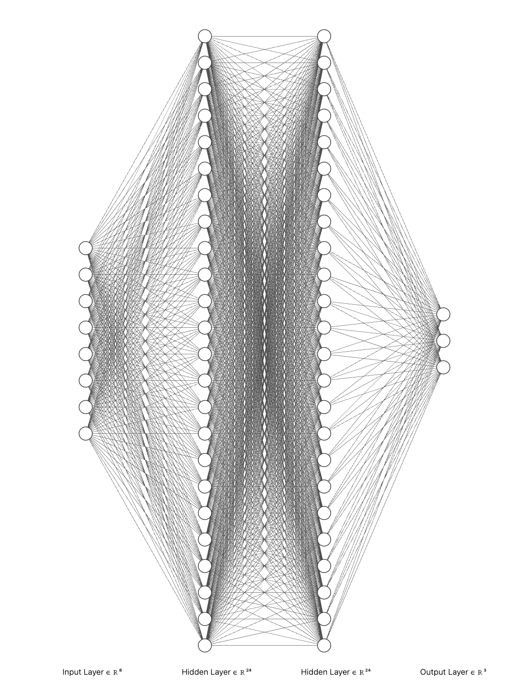
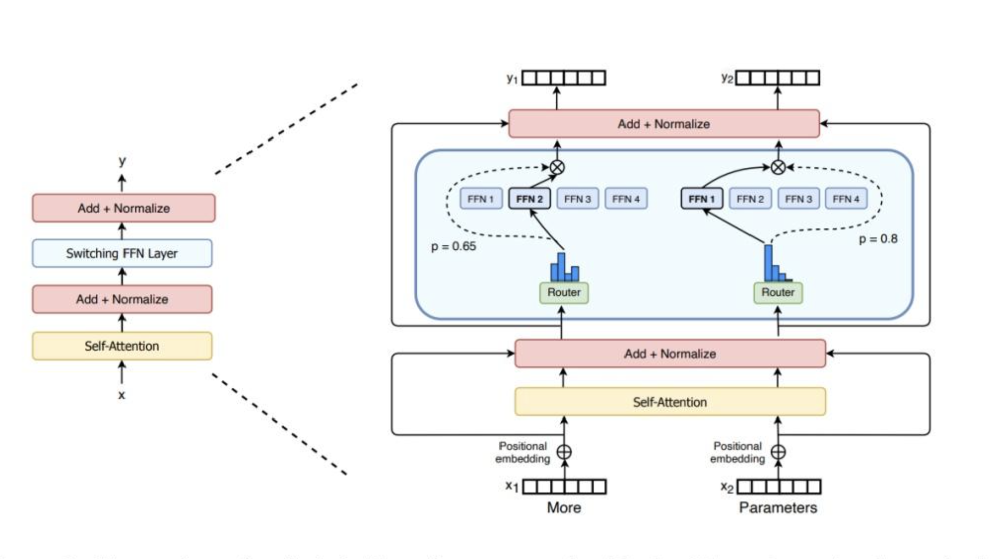
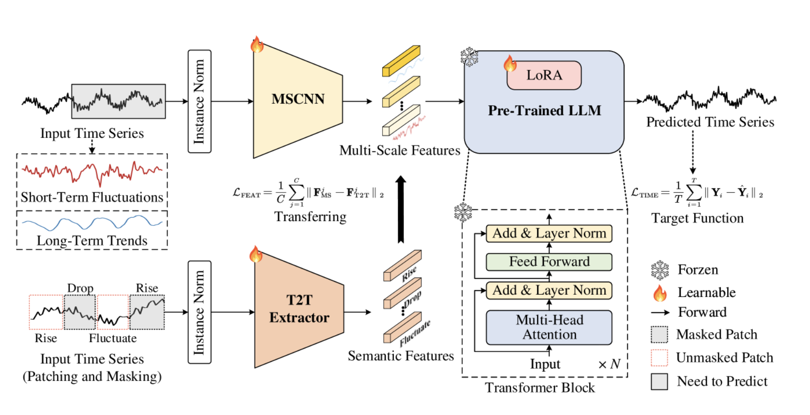
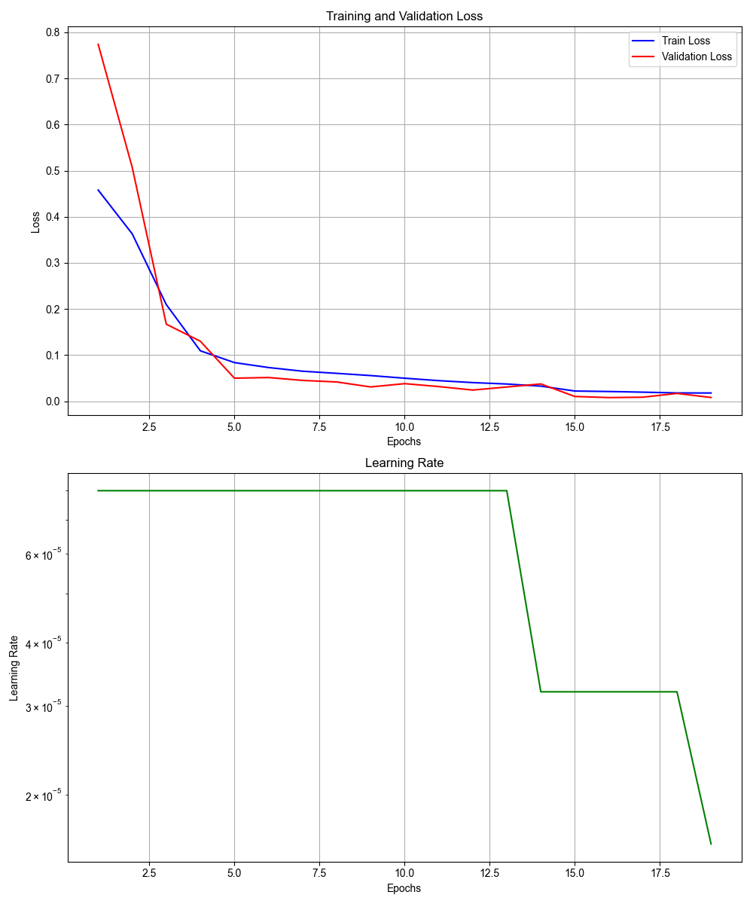
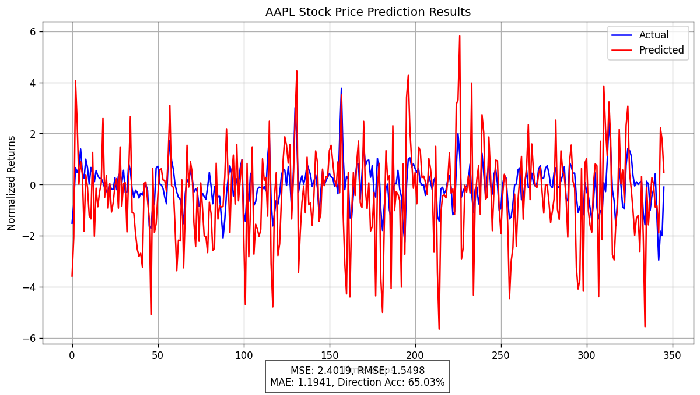
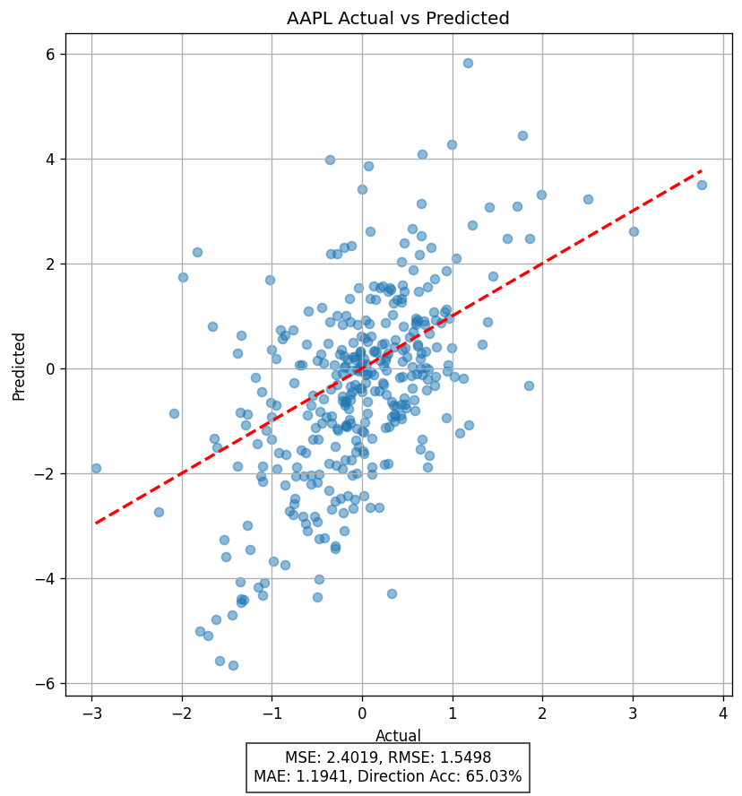
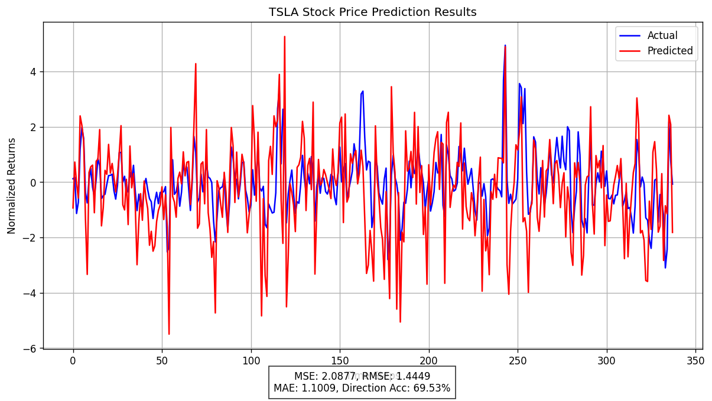
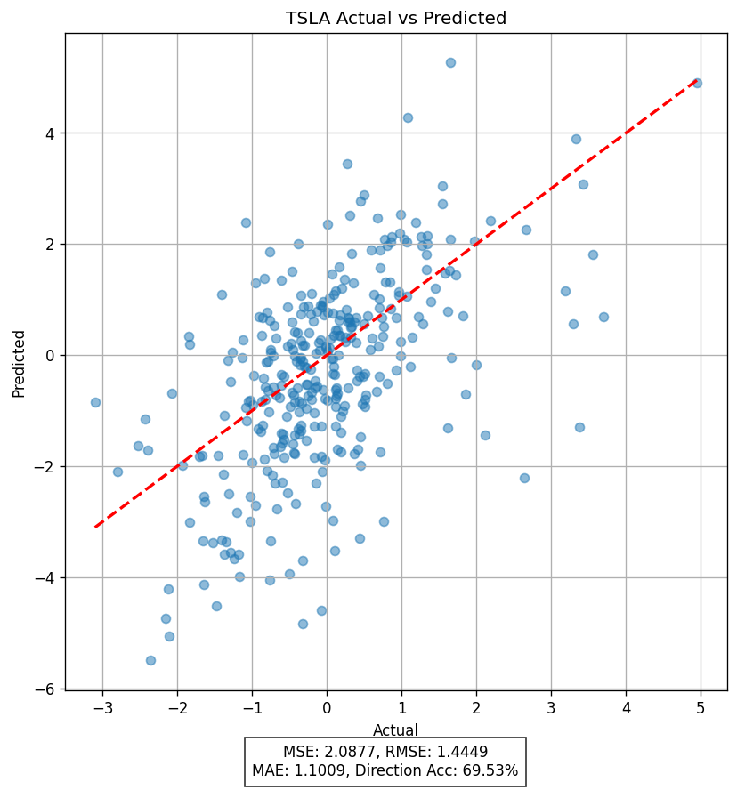
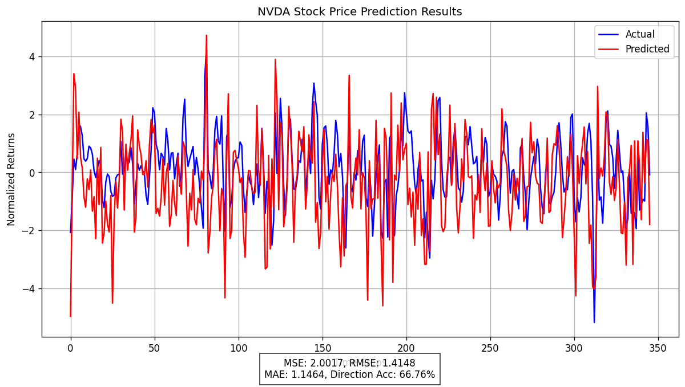
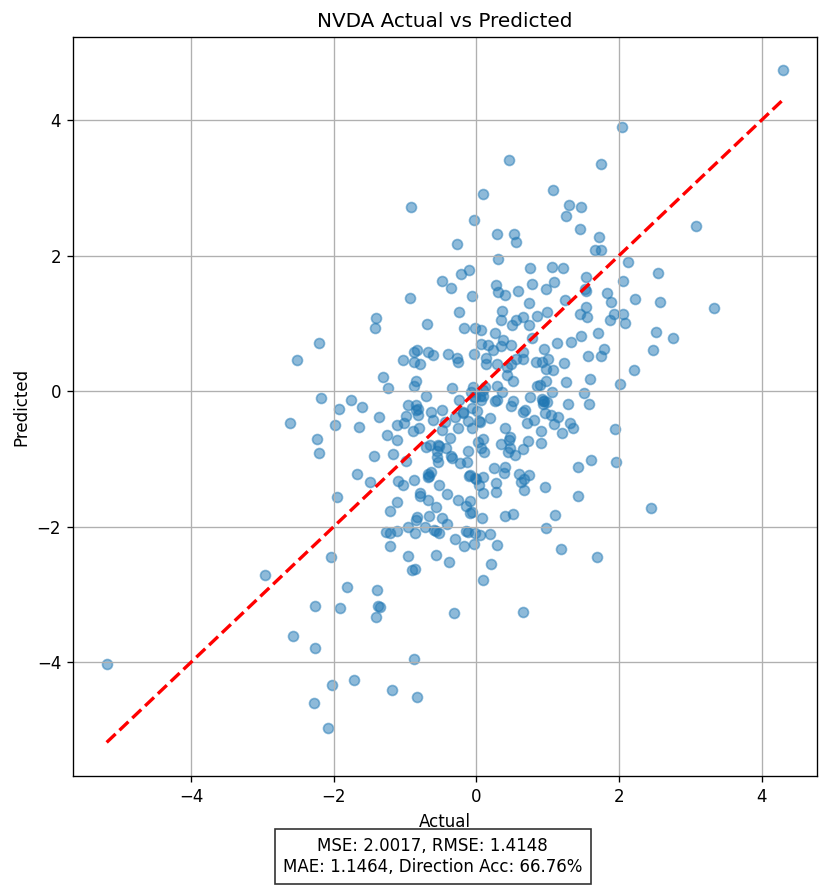

# SpaceExploreAI 时序数据大语言模型TSF-LLM

<div align="center">
  <p>
    <a href="#english">English</a> | 
    <a href="#chinese">中文</a>
  </p>
  
  <div style="display: flex; justify-content: center; align-items: center; gap: 15px;">
    
    
    
    
  </div>
  <p><small>SpaceExplore: Neo, Chrislarn, Cong, Song</small></p>

  <p>
    <a href="https://huggingface.co/NEOAI/SpaceExploreAI-Small-Base-Regression-27M"></a>
  </p>

</div>

---

<a name="english"></a>
# SpaceExploreAI: Time-Series Forecasting LLM (TSF-LLM)

## Nature Songs
SpaceExploreAI Told Me: Like observers confined to our respective vector spaces, we cast projections onto the plane of natural language — and though the map it yields is flawed, it is sufficient to guide us

## Project Introduction

SpaceExploreAI is an investment prediction system based on deep learning networks (TSF-LLM), adopting the state-of-the-art Transformer architecture design. It incorporates various design structures from DeepSeep-V3 and LLama3, such as MLA, MOE, MSCNN, T2T Extractor, and MLP. This model can be used for stock price trend prediction, technical analysis, and investment decision assistance. It combines modern deep learning technologies with traditional financial analysis methods, including technical indicators and time series analysis, providing a comprehensive financial investment prediction solution.

## Open Source Model
SpaceExploreAI-27M model: https://huggingface.co/NEOAI/SpaceExploreAI-Small-Base-Regression-27M

## Open Source Alignment Dataset-SFT&DPO
Fine-tuning and testing dataset (partial data): https://huggingface.co/datasets/NEOAI/Stocks

## Disclaimer
SpaceExploreAI can provide investment decision advice and quantitative trading; support screening investment targets and creating investment strategies. It supports commercial operation but you bear your own responsibility. For commercial support, please contact liguangxian1995@gmail.com

## License
[MIT License](LICENSE)

## Key Features

- **Advanced Model Architecture**: Based on Transformer architecture, integrating advanced technologies such as MLA multi-head latent attention, MoE mixture of experts, and adaptive learning. Introducing multi-scale convolutional network MSCNN to process the long and short cycle mapping of time series data, T2T technology to process semantic features of time series.
- **Rich Technical Indicators**: Built-in over 30 technical analysis indicators, including moving averages, RSI, Fibonacci, MACD, Bollinger Bands, etc., as well as reversal trading strategies, trend trading strategies, and momentum trading strategies.
- **Flexible Training Configuration**: Supports various training parameter configurations, including regression and classification tasks, multi-stock joint training. Later additions include market dynamics, industry dynamics, report analysis, and sentiment indicators. Rich ModelArgs configuration parameters provide model weight changes.
- **Powerful Data Processing Engine**: Fully open-source training scripts, complete data download, and data processing processes.
- **Complete Data Pipeline**: Automated data acquisition, preprocessing, feature engineering, and model training processes.
- **Detailed Model Evaluation**: Provides multiple evaluation metrics Loss, Val_loss, Test_loss, as well as visualization methods to help understand model performance.

## Model Architecture

The core of this project is a time series prediction large language model based on Transformer architecture, TSF-LLM, whose main components include:

1. **DataEngine**: Financial time series data download, cleaning, adding indicators, standardization (RobustScaler), creating training set train, validation set val, test set test
2. **Transformer-Decode-only**: Inherits the architecture design from DeepSeek and LLama3 models, optimizing GQA to MLA and Dense to MOE
3. **MLA**: Multi-head latent attention mechanism with RoPE, enhancing model understanding of time series data, Attention(Q^,K^,V) = softmax((q * k_) / ^Dh) * V
4. **RoPE**: Rotation position encoding, helping model better understand sequence position (time) information,
5. **MOE**: Mixture of experts module, improving model expression ability through multiple expert networks, MOE: shared_exports * 1, router_exports * 8; Exports: MLP
6. **MLP**: Multi-layer perceptron, used for feature conversion, MLP: w2(SwiGLU(w1(x) * w3))
7. **Residual connection and layer normalization**: Ensure effective training of deep networks, RoPE&RMSNorm|BatchNorm|Dynatic Tanh
8. **Trainer**: Model training and debugging through configuration file, Adam
9. **Validator**: Real-time hook training indicators and performance indicators during training, Val_loss
10. **MSCNN**: Multi-scale convolutional network, the first use of MSCNN multi-layer receptive field core to solve the problem of periodicity and long-term distortion of time series data in time dimension
11. **T2T Extractor**: Maps the discrete and sparse nature of time series data to text feature values, used to solve the problem of semantic features in traditional LLM that cannot handle time dimension
12. **Wave function & inverse wave**: Using 4D wave function instead of Fourier transform, wave function can handle discrete data
13. **Logits weight distillation**: Get unsaturated logits, distill sub-model through minimizing loss_KL(t_logits, s_logtis, T)
14. **DPO**: Used for reinforcement learning on specific targets, such as RLHF on Nasdaq 100, with better final inference effect in technology companies
15. **Norm**: First use BatchNorm and Dynamic Tanh to process time series data, normalize time dimension features; MLA, MOE layers continue to use RMSNorm
16. **Dynamic learning rate training**: Dynamically adjust learning rate
17. **SwiGLU activation function**: Use silu activation function, use gate mechanism: SwishGLU = Swish(xW + b) * (xV + c)
18. **DropOut regularization**: Prevent overfitting, used with model parameters, data, activation function, Norm
19. **Cross Entropy Loss Function**: Use MSE loss function if it's Regression task

## RNN Network
4 * Blocks; Blocks: MLA, RoPE, Norm, ResNet, MOE; MOE: shared_exports * 1, router_exports * 8; Exports: MLP; MLP: w2(SwiGLU(w1(x) * w3))


## MOE


## MSCNN


## Loss Training Curve



## System Architecture

### Technical Details

### Multi-head Latent Attention (MLA)

SpaceExploreAI supports various attention mechanisms, providing
    a. Standard multi-head attention MHA,
    b. Group query attention mechanism GQA,
    c. Absorb attention (Absorb Attention), absorb attention comes from DeepSeek latest Attention paper MLA structure. SpaceExploreAI extends traditional self-attention to simultaneously support rotation position encoding (RoPE) and attention head without position encoding, which can better capture long-term and short-term dependency relationships in time series data. The subsequent version adds a weighted time series position encoding to the rotation position encoding, more fitting the non-linear expression of time feature vectors before and after opening.

1. Standard multi-head attention (Standard Multi-head Attention)
Principle:
    Each input sequence position has independent Q, K, V projections
    All attention heads have independent parameters
    Calculation complexity is O(n²d), where n is sequence length, d is hidden dimension
Advantages:
    Strongest expression ability
    Simple and intuitive implementation
Disadvantages:
    Large calculation and memory overhead
    Not friendly to long sequences

2. Grouped query attention (Grouped-Query Attention, GQA)
Principle:
    Q head number is more than K and V head number
    Multiple Q heads share the same K/V head
    Usually K/V head number is 1/4 or 1/8 of Q head number
Advantages:
    Significantly reduce parameter and memory usage
    Maintain most expression ability
    Suitable for long sequences and large models
Implementation points:
    Group Q heads, each corresponding to a K/V head
    Use einsum for efficient batch matrix multiplication
    Cache use less K/V heads
3. Absorb attention (Absorb Attention)
Principle:
    Do not cache the final K and V matrices, but cache intermediate potential representations
    Decompose matrix multiplication into smaller operations
    Use low-rank decomposition to reduce calculation
Advantages:
    Higher memory efficiency
    Higher calculation efficiency, especially for incremental decoding
    Suitable for resource-constrained environments
Implementation points:
    Cache KV potential projections and position encoding
    Apply weight matrix to cached potential representations
    Use einsum for efficient tensor operations

#### Mixed Expert Model (MoE)

The MoE architecture used in the system contains multiple parallel feedforward networks (“experts”), with a routing network dynamically selecting the most suitable expert combination for each input:

- **Expert number**: Default 8 experts
- **Each token activates expert number**: Default 2 experts
- **Routing algorithm**: Sparse MoE based on Top-K selection
- **Shared experts**: Shared experts one, default activated

#### Optimization techniques

- **Mixed precision training**: Use FP16/BF16 to accelerate training process (awaiting subsequent addition of DeepSeek FP8)
- **Gradient accumulation**: Support larger effective batch size
- **Early stopping mechanism**: Prevent overfitting
- **Learning rate scheduling**: Use ReduceLROnPlateau strategy

## Installation Guide

### Dependencies

```bash
pip install pandas numpy torch matplotlib tqdm scikit-learn pandas_ta yfinance seaborn
```

### Install from source code

```bash
git clone https://github.com/yourusername/SpaceExploreAI.git
cd SpaceExploreAI
pip install -e .
```

## Quick Start

Using the provided quick start script can easily complete the complete process from data download to model evaluation:

```bash
python -m SpaceExploreAI.examples.quick_start --tickers AAPL --num_epochs 10
```

This command will:
1. Download historical data for Apple stocks
2. Process data and calculate technical indicators
3. Train prediction model
4. Evaluate model performance and generate visualization results

## Detailed Usage Guide

### 1. Data Acquisition

```bash
python -m SpaceExploreAI.data.download_data --tickers AAPL,MSFT,GOOGL --start_date 2010-01-01
```

#### Supported Data Sources

Currently, the system mainly supports data acquisition from Yahoo Finance, with plans to support more data sources in the future:

- **Yahoo Finance**: Free historical stock data
- **Future plans to support**: AlphaVantage, Quandl, IEX Cloud, etc.

#### Data Directory Structure

Downloaded raw data will be saved in the following structure:

```
data/raw/price_history/
├── AAPL/
│   └── AAPL_yahoo_20230301.csv
├── MSFT/
│   └── MSFT_yahoo_20230301.csv
└── ...
```

### 2. Data Processing Flow

Stock data needs to go through a series of processing steps before training:

1. **Load original price data**: Load OHLCV (open, high, low, close, volume) data from CSV file
2. **Clean data**: Handle missing values, anomalies, and time series gaps
3. **Calculate technical indicators**: Use `technical_indicators.py` to calculate over 30 technical indicators
4. **Feature selection**: Specific feature combinations can be selected through `--feature_groups` parameter
5. **Feature scaling**: Use Robust/Standard/MinMax scalers to standardize features
6. **Sequence creation**: Build input-output sequence pairs according to `sequence_length` and `prediction_horizon`
7. **Training-validation-test split**: Default ratio is 80%-10%-10%

### 3. Model Training

Basic training:

```bash
python -m SpaceExploreAI.train.train_model --tickers AAPL --sequence_length 60 --prediction_horizon 5 --num_epochs 30
```

Multi-stock joint training:

```bash
python -m SpaceExploreAI.train.train_model --tickers AAPL,MSFT,GOOGL --merge_stocks
```

Classification task (predicting up/down):

```bash
python -m SpaceExploreAI.train.train_model --tickers AAPL --prediction_type classification
```

### 4. Model Evaluation

```bash
python -m SpaceExploreAI.evaluate.evaluate_model --model_path ./models/stock_transformer_best.pt --test_data AAPL
```

## Technical Indicators

The system's built-in technical indicators include:

- Moving averages (MA, EMA)
- Relative strength index (RSI)
- Stochastic oscillator (Stochastic Oscillator)
- MACD (Moving Average Convergence Divergence)
- Bollinger Bands (Bollinger Bands)
- Average true range (ATR)
- On-balance volume (OBV)
- Ichimoku Cloud (Ichimoku Cloud)
- Fibonacci retracement level
- Price channel
- Volatility indicators
- Momentum indicators
- Reversal indicators
- Trend indicators

## Advanced Usage

### Adjust model architecture

```bash
python -m SpaceExploreAI.train.train_model --hidden_size 512 --num_layers 6 --num_heads 8
```

### Adjust mixed expert parameters

```bash
python -m SpaceExploreAI.train.train_model --moe_intermediate_size 512 --num_experts 16 --num_experts_per_token 4
```

### Resume training from checkpoint

```bash
python -m SpaceExploreAI.train.train_model --resume_from ./models/stock_transformer_last.pt
```

## Model Effectiveness

The model has been widely tested against different stocks and market conditions, showing good prediction ability:

- **Regression task**: Predict direction and magnitude of future price movement
- **Classification task**: Predict probability of stock price up/down/flat

Typical evaluation indicators include:
- MSE (Mean Squared Error)
- RMSE (Root Mean Squared Error)
- MAE (Mean Absolute Error)
- Direction accuracy (Accuracy of stock price direction prediction)

### Latest Evaluation Results

Below is a comprehensive evaluation of the model on multiple stock tickers:

| 股票代码 | MSE | RMSE | MAE | 方向准确率 |
|:-------:|:----:|:----:|:---:|:----------:|
| AAPL | 2.4019 | 1.5498 | 1.1941 | 65.03% |
| TSLA | 2.0877 | 1.4449 | 1.1009 | 69.53% |
| NVDA | 2.0017 | 1.4148 | 1.1464 | 66.76% |
| GOOG | 3.4042 | 1.8451 | 1.4648 | 67.05% |
| QQQ | 3.4753 | 1.8642 | 1.5103 | 70.52% |

As shown above, the model achieves direction prediction accuracy ranging from 65% to over 70%, with QQQ (NASDAQ ETF) showing the highest direction accuracy at 70.52%.

### 预测结果可视化

以下是模型在不同股票上的预测表现可视化：

<div align="center">
  <h4>苹果 (AAPL) 股票预测</h4>
  <table>
    <tr>
      <td></td>
      <td></td>
    </tr>
    <tr>
      <td align="center">时间序列预测</td>
      <td align="center">实际值与预测值散点图</td>
    </tr>
  </table>

  <h4>特斯拉 (TSLA) 股票预测</h4>
  <table>
    <tr>
      <td></td>
      <td></td>
    </tr>
    <tr>
      <td align="center">时间序列预测</td>
      <td align="center">实际值与预测值散点图</td>
    </tr>
  </table>

  <h4>英伟达 (NVDA) 股票预测</h4>
  <table>
    <tr>
      <td></td>
      <td></td>
    </tr>
    <tr>
      <td align="center">时间序列预测</td>
      <td align="center">实际值与预测值散点图</td>
    </tr>
  </table>
</div>

蓝线表示实际值，红线表示模型的预测值。散点图显示了预测值与实际值之间的相关性，对角线代表完美预测。

## Project Vision

According to the project introduction document, the ultimate goal of SpaceExploreAI stock price prediction large model is:

1. Achieve direct interaction capability similar to large language models, users can directly ask stock-related questions
2. Have the ability to obtain real-time stock information and perform technical analysis, fundamental analysis, and quantitative analysis
3. Provide real-time investment advice and investment strategies

The current version focuses on time series prediction capability, and future versions will further enhance interaction and real-time analysis capability.

## Contribution Guide

Welcome to contribute to the project! You can participate in the following ways:

1. Submit bug reports or feature requests
2. Submit code improvements or new features
3. Improve documentation

## Case Analysis

### Case 1: Apple Stock Price Prediction

Below is an example of using the model to predict Apple company stock price movement for the next 5 days:

#### Training Command

```bash
python -m SpaceExploreAI.train.train_model --tickers AAPL --sequence_length 60 --prediction_horizon 5 --hidden_size 256 --num_layers 4 --num_heads 4 --num_epochs 30
```

#### Key Results

- **MSE**: 2.4019
- **Direction accuracy**: 65.03%
- **Average training time**: 15 minutes (single GPU)

### Case 2: Multi-stock Joint Training

By jointly training FAANG stocks (Facebook/Meta, Apple, Amazon, Netflix, Google) to improve model generalization ability:

```bash
python -m SpaceExploreAI.train.train_model --tickers META,AAPL,AMZN,NFLX,GOOGL --merge_stocks --num_epochs 50
```

The model's performance on single stock is significantly improved compared to the model trained separately, especially in periods of large market volatility.

## Custom Model and Extension

### Add new technical indicators

New technical indicators can be added through extending the `TechnicalIndicatorProcessor` class:

```python
# SpaceExploreAI/data/technical_indicators.py
class CustomIndicatorProcessor(TechnicalIndicatorProcessor):
    def __init__(self):
        super().__init__()
        
    def add_custom_indicator(self, df):
        # Implement custom indicator calculation
        df['custom_indicator'] = ...
        return df
        
    def calculate_all_indicators(self, df):
        df = super().calculate_all_indicators(df)
        df = self.add_custom_indicator(df)
        return df
```

### Create custom prediction tasks

In addition to the default price prediction, you can define your own prediction tasks, such as predicting volatility, trading volume, or specific technical indicators:

```python
# Example: Create volatility prediction task
def create_volatility_targets(price_data, window=21):
    returns = price_data['close'].pct_change()
    volatility = returns.rolling(window=window).std() * np.sqrt(252)
    return volatility.shift(-1)  # Predict next day's volatility
```

## Performance Optimization

### Hardware Recommendation

- **Training**: GPU memory ≥ 8GB (recommended NVIDIA RTX 3060 or higher)
- **Inference**: CPU or GPU can be used
- **Memory**: ≥ 16GB RAM

### Hyperparameter Optimization

Below are some key hyperparameters and their adjustment suggestions:

| Parameter | Description | Recommended Range | Impact |
|----------|----------|----------|------|
| learning_rate | Learning rate | 1e-5 ~ 1e-3 | Convergence speed and stability |
| hidden_size | Hidden layer dimension | 128 ~ 512 | Model capacity and training speed |
| num_layers | Transformer layer number | 2 ~ 8 | Model depth and complexity |
| num_heads | Attention head number | 4 ~ 16 | Parallel feature learning ability |
| num_experts | MoE expert number | 4 ~ 32 | Model capacity and calculation complexity |
| sequence_length | Input sequence length | 30 ~ 120 | Historical dependency and training efficiency |

## Real-time Prediction and Deployment

### Deploy model API

You can create model API service using Flask/FastAPI:

```python
from flask import Flask, request, jsonify
from SpaceExploreAI.train.trainer import create_stock_predictor_from_checkpoint

app = Flask(__name__)
predictor = create_stock_predictor_from_checkpoint("./models/stock_transformer_best.pt")

@app.route('/predict', methods=['POST'])
def predict():
    data = request.json
    ticker = data['ticker']
    # Get latest data and process
    # ...
    prediction = predictor.predict(processed_data)
    return jsonify({"prediction": prediction.tolist()})

if __name__ == '__main__':
    app.run(host='0.0.0.0', port=5000)
```

### Real-time Data Integration

You can use third-party API or data service to obtain real-time market data and integrate with the model:

```python
import yfinance as yf
import pandas as pd
from datetime import datetime, timedelta

def get_latest_data(ticker, sequence_length=60):
    # Get latest market data
    end_date = datetime.now()
    start_date = end_date - timedelta(days=sequence_length * 2)  # Get enough historical data
    
    data = yf.download(ticker, start=start_date, end=end_date)
    # Process data and calculate technical indicators
    # ...
    return processed_data
```

## Common Questions and Answers

### Q: How to handle missing stock price data?

A: The system uses forward fill (Forward Fill) to handle missing values during trading days. For long-term missing data, it's recommended to obtain complete data source or use interpolation method. You can customize missing value processing strategy by extending the `StockDataProcessor` class.

### Q: What's the difference between regression prediction and classification prediction?

A: 
- **Regression prediction**: Directly predict future price movement magnitude (continuous value)
- **Classification prediction**: Predict price movement direction (up, down, flat)

Regression prediction is suitable for scenarios requiring precise price movement, while classification prediction is suitable for trading strategy focusing only on movement direction.

### Q: Does the model support seasonal and periodic features?

A: Yes. Multi-head latent attention and rotation position encoding allow model to capture periodic patterns in time series. In addition, technical indicators processor also adds time features (such as day of week, month, quarter, etc.) to help model identify seasonal factors.

### Q: How to interpret model prediction results?

A: Prediction results are usually normalized price movement or probability distribution:

- **Regression prediction**: Return normalized future yield, need to use same scaler to reverse transform to actual price movement
- **Classification prediction**: Return probability distribution of various categories, for example [0.2, 0.7, 0.1] represents the probability of down, up, and flat

You can use the following code to reverse transform back to actual price movement:

```python
# Regression prediction reverse transform
actual_change = processor.scalers[ticker]['target'].inverse_transform(prediction)
next_price = current_price * (1 + actual_change)
```

## Research and Reference

If you use this project in your research, please cite:

```
@misc{SpaceExploreAI2025,
  author = {li-neo&chang zunling},
  title = {SpaceExploreAI: A Transformer-based Stock Price Prediction System},
  year = {2025},
  publisher = {GitHub & Hugging Face},
  url = {https://github.com/li-neo/SpaceExploreAI}
}
```

## Version History
- **v1.1.0** (2025-03-25): Added LLM-PS attribute: Added MSCNN & T2T Extractor module
- **v1.0.0** (2025-03-12): Initial version, including core prediction functionality
- **v0.3.0** (2024-12-07): Beta version, optimize large model attention model, changed to MLA, increased multi-expert MOE, added API, UI, test sample
- **v0.2.0** (2024-06-12): Beta version, added Transformer module, data import, Embedding, cleaning
- **v0.1.0** (2024-02-01): Beta version, version planning, demand, design

## Community and Support

- **Issue reporting**: Please submit issues in [GitHub Issues](https://github.com/li-neo/SpaceExploreAI/issues)
- **Contact email**: liguangxian1995@gmail.com 

## Acknowledgment

Thanks to project partner Chang Zunling's all-night work and thanks to Jiao A's support and help in investment strategy, as well as ChatGPT, DeepSeek, LLama3, Hugging Face's exploration in AI field.

<a name="chinese"></a>
# SpaceExploreAI 时序数据大语言模型TSF-LLM

## 人类挽歌 (Nature Songs)
SpaceExploreAI对我说：我们如同被困在各自向量空间的观察者，但通过投影到自然语言平面，得以绘制出一张不完美却足够实用的地图。

## 项目介绍

SpaceExploreAI 是一个基于深度学习网络的投资预测系统TSF-LLM，采用最先进的 Transformer 架构设计，更是吸取了DeepSeep-V3、LLama3的多种设计结构，如MLA、MOE、MSCNN、T2T Extrctor、MLP；此模型可用于股票价格趋势预测、技术分析和投资决策辅助，并结合了现代深度学习技术和传统金融分析方法，包括技术指标、时间序列分析等，提供了一个全面的金融投资预测解决方案。

## 开源模型
SpaceExploreAI-27M模型开源地址： https://huggingface.co/NEOAI/SpaceExploreAI-Small-Base-Regression-27M

## 开源对齐数据集-SFT&DPO
微调和测试数据集开源地址（部分Data）： https://huggingface.co/datasets/NEOAI/Stocks

## 免责声明
SpaceExploreAI可以提供投资决策建议、量化交易；支持筛选投资标的、创建投资策略；支持商业运行但自负责任，如需要获得商业支持，请联系liguangxian1995@gmail.com

## License
[MIT License](LICENSE)

## 主要特点

- **先进的模型架构**：基于 Transformer 架构，集成了 MLA 多头潜在注意力、MoE 混合专家和自适应学习等先进技术、引入多尺度卷积网络MSCNN处理时序数据的长短周期映射，T2T技术处理时间序列的语义特征
- **丰富的技术指标**：内置超过 30 种技术分析指标，包括移动平均线、RSI、斐波那契、MACD、布林带等，同时包含反转交易策略、趋势交易策略、动量交易策略
- **灵活的训练配置**：支持多种训练参数配置，包括回归和分类任务、多股票联合训练，后续添加市场动态、行业动态、报表分析和情绪指标，ModelArgs配置参数丰富，提供模型权重更改
- **强悍的数据处理引擎**：完全开源训练脚本，完整的数据下载、以及数据处理过程
- **完整数据流水线**：自动化的数据获取、预处理、特征工程和模型训练流程
- **详细的模型评估**：提供多种评估指标Loss，Val_loss，Test_loss, 以及可视化方法，帮助理解模型性能

## 模型架构

该项目的核心是一个基于 Transformer 架构的时间序列预测大语言模型 TSF-LLM，其主要组件包括：

1. **DataEngine**：金融时序数据下载、清洗、添加指标、标准化（RobustScaler）、创建数据训练集train、验证集val、测试集test
2. **Transformer-Decode-only**：借鉴 DeepSeek 和 LLama3 大模型的架构设计，将GQA优化为MLA，将Dense优化为MOE
3. **MLA**：多头潜在注意力机制配合RoPE，增强模型对时间序列数据的理解，Attention(Q^,K^,V) = softmax((q * k_) / ^Dh) * V
4. **RoPE**：旋转位置编码，帮助模型更好地理解序列位置(时间)信息,
5. **MOE**：混合专家模块，通过多个专家网络提高模型表达能力, MOE：shared_exports * 1, router_exports * 8; Exports: MLP
6. **MLP**：多层感知器，用于特征转换，MLP：w2(SwiGLU(w1(x) * w3))
7. **残差连接和层归一化**：确保深层网络的有效训练, RoPE&RMSNorm|BatchNorm|Dynatic Tanh
8. **训练器**：通过配置文件，进行模型训练和调试, Adam
9. **验证器**：训练过程中，实时hook训练指标和性能指标, Val_loss
10. **MSCNN**：多尺度卷积网络，业界首次采用MSCNN多层感受野核解决时序数据在时间对维度上的周期性和长期性的失真问题
11. **T2T Extractor**：将时序数据的离散和稀疏性问题映射到文本特征值，用来解决传统LLM无法处理时间维度的语义特征问题
12. **小波函数&逆小波**：使用4D小波函数代替傅立叶变换，小波函数可以处理离散的数据
13. **Logits权重蒸馏器**：获取未softmax的logits，通过最小化loss_KL(t_logits, s_logtis，T)来蒸馏子模型
14. **DPO**：用于对特定标的进行强化学习，如对纳斯达克100进行RLHF，最终推理效果在科技公司中更有优势
15. **Norm**：首先采用BatchNorm和Dynamic Tanh对时间序列数据进行处理，归一化时间维度特征；MLA、MOE层则延用RMSNorm
16. **动态学习率训练**：动态调整学习率
17. **SwiGLU激活函数**：采用silu激活函数，采用门控机制： SwishGLU = Swish(xW + b) * (xV + c)
18. **DropOut正则化**：防止过拟合，配合模型参数、数据、激活函数、Norm使用
19. **交叉熵损失函数CrossEntropyLoss**：若是Regression任务则使用MSE损失函数

## RNN网络
4 * Blocks； Blocks：MLA、RoPE、Norm、ResNet、MOE； MOE：shared_exports * 1, router_exports * 8; Exports: MLP； MLP：w2(SwiGLU(w1(x) * w3))


## MOE


## MSCNN


## Loss训练曲线


## 系统架构

### 技术细节

### 多头潜在注意力 (MLA)

SpaceExploreAI 支持多种注意力机制选择，提供
    a.标准多头注意力MHA，
    b.组查询注意力机制GQA，
    c.吸收式注意力(Absorb Attention)，吸收式注意力来自DeepSeek最新Attention论文MLA结构。 SpaceExploreAI将传统的自注意力扩展为同时支持旋转位置编码 (RoPE) 和无位置编码的注意力头，能够更好地捕捉时间序列数据中的长期和短期依赖关系。 后续版本在旋转位置编码的基础上，加权一个时间序列位置编码，更加拟合开盘前后的时间特征向量的非线性表达。

1. 标准多头注意力（Standard Multi-head Attention）
原理：
    每个输入序列位置都有独立的Q、K、V投影
    所有注意力头都有独立的参数
    计算复杂度为O(n²d)，其中n是序列长度，d是隐藏维度
优点：
    表达能力最强
    实现简单直观
缺点：
    计算和内存开销大
    对长序列不友好

2. 分组查询注意力（Grouped-Query Attention, GQA）
原理：
    Q头数量多于K和V头数量
    多个Q头共享同一个K/V头
    通常K/V头数量是Q头数量的1/4或1/8
优点：
    显著减少参数量和内存使用
    保持大部分表达能力
    适合长序列和大模型
实现要点：
    将Q头分组，每组对应一个K/V头
    使用einsum进行高效的批量矩阵乘法
    缓存使用较少的K/V头
3. 吸收式注意力（Absorb Attention）
原理：
    不缓存最终的K和V矩阵，而是缓存中间的潜在表示
    将矩阵乘法分解为更小的操作
    利用低秩分解减少计算量
优点：
    内存效率更高
    计算效率更高，特别是对增量解码
    适合资源受限的环境
实现要点：
    缓存KV潜在投影和位置编码
    将权重矩阵应用到缓存的潜在表示上
    使用einsum进行高效的张量运算

#### 混合专家模型 (MoE)

系统使用的 MoE 架构包含多个并行的前馈网络（"专家"），由一个路由网络动态地为每个输入选择最合适的专家组合：

- **专家数量**: 默认 8 个专家
- **每个 token 激活专家数**: 默认 2 个
- **路由算法**: 基于 Top-K 选择的稀疏 MoE
- **共享专家**: 共享专家一个，默认激活

#### 优化技术

- **混合精度训练**：利用 FP16/BF16 加速训练过程（等后续添加DeepSeek FP8）
- **梯度累积**：支持更大的有效批量大小
- **早停机制**：防止过拟合
- **学习率调度**：使用 ReduceLROnPlateau 策略

## 安装指南

### 依赖项

```bash
pip install pandas numpy torch matplotlib tqdm scikit-learn pandas_ta yfinance seaborn
```

### 从源码安装

```bash
git clone https://github.com/yourusername/SpaceExploreAI.git
cd SpaceExploreAI
pip install -e .
```

## 快速入门

使用提供的快速入门脚本可以轻松完成从数据下载到模型评估的完整流程：

```bash
python -m SpaceExploreAI.examples.quick_start --tickers AAPL --num_epochs 10
```

这个命令将：
1. 下载 Apple 股票的历史数据
2. 处理数据并计算技术指标
3. 训练预测模型
4. 评估模型性能并生成可视化结果

## 详细使用指南

### 1. 数据获取

```bash
python -m SpaceExploreAI.data.download_data --tickers AAPL,MSFT,GOOGL --start_date 2010-01-01
```

#### 支持的数据源

目前系统主要支持从 Yahoo Finance 获取数据，后续将支持更多数据源：

- **Yahoo Finance**: 免费的历史股票数据
- **未来计划支持**: AlphaVantage, Quandl, IEX Cloud 等

#### 数据目录结构

下载的原始数据将保存在以下结构：

```
data/raw/price_history/
├── AAPL/
│   └── AAPL_yahoo_20230301.csv
├── MSFT/
│   └── MSFT_yahoo_20230301.csv
└── ...
```

### 2. 数据处理流程

股票数据在训练前需要经过一系列处理步骤：

1. **加载原始价格数据**：从 CSV 文件加载 OHLCV (开盘价、最高价、最低价、收盘价、成交量) 数据
2. **清洗数据**：处理缺失值、异常值和时间序列缺口
3. **计算技术指标**：使用 `technical_indicators.py` 计算超过 30 种技术指标
4. **特征选择**：可以通过 `--feature_groups` 参数选择特定特征组合
5. **特征缩放**：使用 Robust/Standard/MinMax 缩放器标准化特征
6. **序列创建**：根据 `sequence_length` 和 `prediction_horizon` 构建输入-输出序列对
7. **训练-验证-测试拆分**：默认比例为 80%-10%-10%

### 3. 模型训练

基本训练：

```bash
python -m SpaceExploreAI.train.train_model --tickers AAPL --sequence_length 60 --prediction_horizon 5 --num_epochs 30
```

多股票联合训练：

```bash
python -m SpaceExploreAI.train.train_model --tickers AAPL,MSFT,GOOGL --merge_stocks
```

分类任务（预测上涨/下跌）：

```bash
python -m SpaceExploreAI.train.train_model --tickers AAPL --prediction_type classification
```

### 4. 模型评估

```bash
python -m SpaceExploreAI.evaluate.evaluate_model --model_path ./models/stock_transformer_best.pt --test_data AAPL
```

## 技术指标

系统内置的技术指标包括：

- 移动平均线 (MA, EMA)
- 相对强弱指数 (RSI)
- 随机振荡器 (Stochastic Oscillator)
- MACD (Moving Average Convergence Divergence)
- 布林带 (Bollinger Bands)
- 平均真实范围 (ATR)
- 能量潮 (OBV)
- 一目均衡表 (Ichimoku Cloud)
- 斐波那契回调水平
- 价格通道
- 波动率指标
- 动量指标
- 反转指标
- 趋势指标

## 高级使用

### 调整模型架构

```bash
python -m SpaceExploreAI.train.train_model --hidden_size 512 --num_layers 6 --num_heads 8
```

### 调整混合专家参数

```bash
python -m SpaceExploreAI.train.train_model --moe_intermediate_size 512 --num_experts 16 --num_experts_per_token 4
```

### 从检查点恢复训练

```bash
python -m SpaceExploreAI.train.train_model --resume_from ./models/stock_transformer_last.pt
```

## 模型有效性

该模型已广泛测试于不同股票和市场条件，显示出良好的预测能力：

- **回归任务**：预测未来价格走势的方向和幅度
- **分类任务**：预测股票价格上涨/下跌/横盘的概率

典型评估指标包括：
- MSE (均方误差)
- RMSE (均方根误差)
- MAE (平均绝对误差)
- Direction accuracy (股价方向预测准确率)

### Latest Evaluation Results

Below is a comprehensive evaluation of the model on multiple stock tickers:

| 股票代码 | MSE | RMSE | MAE | 方向准确率 |
|:-------:|:----:|:----:|:---:|:----------:|
| AAPL | 2.4019 | 1.5498 | 1.1941 | 65.03% |
| TSLA | 2.0877 | 1.4449 | 1.1009 | 69.53% |
| NVDA | 2.0017 | 1.4148 | 1.1464 | 66.76% |
| GOOG | 3.4042 | 1.8451 | 1.4648 | 67.05% |
| QQQ | 3.4753 | 1.8642 | 1.5103 | 70.52% |

As shown above, the model achieves direction prediction accuracy ranging from 65% to over 70%, with QQQ (NASDAQ ETF) showing the highest direction accuracy at 70.52%.

### 预测结果可视化

以下是模型在不同股票上的预测表现可视化：

<div align="center">
  <h4>苹果 (AAPL) 股票预测</h4>
  <table>
    <tr>
      <td></td>
      <td></td>
    </tr>
    <tr>
      <td align="center">时间序列预测</td>
      <td align="center">实际值与预测值散点图</td>
    </tr>
  </table>

  <h4>特斯拉 (TSLA) 股票预测</h4>
  <table>
    <tr>
      <td></td>
      <td></td>
    </tr>
    <tr>
      <td align="center">时间序列预测</td>
      <td align="center">实际值与预测值散点图</td>
    </tr>
  </table>

  <h4>英伟达 (NVDA) 股票预测</h4>
  <table>
    <tr>
      <td></td>
      <td></td>
    </tr>
    <tr>
      <td align="center">时间序列预测</td>
      <td align="center">实际值与预测值散点图</td>
    </tr>
  </table>
</div>

蓝线表示实际值，红线表示模型的预测值。散点图显示了预测值与实际值之间的相关性，对角线代表完美预测。

## 项目愿景

根据项目介绍文档，SpaceExploreAI股票价格预测大模型的最终目标是：

1. 实现类似大语言模型的直接交互能力，用户可以直接询问股票相关问题
2. 具备获取实时股票信息并进行技术分析、基本面分析和量化分析的能力
3. 提供实时投资建议和投资策略

当前版本专注于时间序列预测能力，未来版本将进一步增强交互和实时分析能力。

## 贡献指南

欢迎为项目做出贡献！您可以通过以下方式参与：

1. 提交错误报告或功能请求
2. 提交代码改进或新功能
3. 改进文档

## 案例分析

### 案例1：苹果股票价格预测

以下是使用模型预测苹果公司未来5天股票价格走势的示例：

#### 训练命令

```bash
python -m SpaceExploreAI.train.train_model --tickers AAPL --sequence_length 60 --prediction_horizon 5 --hidden_size 256 --num_layers 4 --num_heads 4 --num_epochs 30
```

#### 关键结果

- **MSE**: 2.4019
- **方向准确率**: 65.03%
- **平均训练时间**: 15分钟（单GPU）

### 案例2：多股票联合训练

通过联合训练FAANG股票（Facebook/Meta、苹果、亚马逊、Netflix、谷歌）来提高模型泛化能力：

```bash
python -m SpaceExploreAI.train.train_model --tickers META,AAPL,AMZN,NFLX,GOOGL --merge_stocks --num_epochs 50
```

模型在单一股票上的表现相较于单独训练的模型有显著提升，尤其是在市场大幅波动期间。

## 自定义模型和扩展

### 添加新的技术指标

可以通过扩展`TechnicalIndicatorProcessor`类来添加新的技术指标：

```python
# SpaceExploreAI/data/technical_indicators.py
class CustomIndicatorProcessor(TechnicalIndicatorProcessor):
    def __init__(self):
        super().__init__()
        
    def add_custom_indicator(self, df):
        # 实现自定义指标计算
        df['custom_indicator'] = ...
        return df
        
    def calculate_all_indicators(self, df):
        df = super().calculate_all_indicators(df)
        df = self.add_custom_indicator(df)
        return df
```

### 创建自定义预测任务

除了默认的价格预测外，您可以定义自己的预测任务，如预测波动率、交易量或特定技术指标：

```python
# 示例：创建波动率预测任务
def create_volatility_targets(price_data, window=21):
    returns = price_data['close'].pct_change()
    volatility = returns.rolling(window=window).std() * np.sqrt(252)
    return volatility.shift(-1)  # 预测下一天的波动率
```

## 性能优化

### 硬件推荐

- **训练**: GPU内存 ≥ 8GB（推荐NVIDIA RTX 3060或更高）
- **推理**: CPU 或 GPU 均可
- **内存**: ≥ 16GB RAM

### 超参数调优

以下是一些关键超参数及其调整建议：

| 参数 | 描述 | 推荐范围 | 影响 |
|----------|----------|----------|------|
| learning_rate | 学习率 | 1e-5 ~ 1e-3 | 收敛速度和稳定性 |
| hidden_size | 隐藏层维度 | 128 ~ 512 | 模型容量和训练速度 |
| num_layers | Transformer层数 | 2 ~ 8 | 模型深度和复杂度 |
| num_heads | 注意力头数量 | 4 ~ 16 | 并行特征学习能力 |
| num_experts | MoE专家数量 | 4 ~ 32 | 模型容量和计算复杂度 |
| sequence_length | 输入序列长度 | 30 ~ 120 | 历史依赖性和训练效率 |

## 实时预测和部署

### 部署模型API

您可以使用Flask/FastAPI创建模型API服务：

```python
from flask import Flask, request, jsonify
from SpaceExploreAI.train.trainer import create_stock_predictor_from_checkpoint

app = Flask(__name__)
predictor = create_stock_predictor_from_checkpoint("./models/stock_transformer_best.pt")

@app.route('/predict', methods=['POST'])
def predict():
    data = request.json
    ticker = data['ticker']
    # 获取最新数据并处理
    # ...
    prediction = predictor.predict(processed_data)
    return jsonify({"prediction": prediction.tolist()})

if __name__ == '__main__':
    app.run(host='0.0.0.0', port=5000)
```

### 实时数据集成

您可以使用第三方API或数据服务获取实时市场数据，并与模型集成：

```python
import yfinance as yf
import pandas as pd
from datetime import datetime, timedelta

def get_latest_data(ticker, sequence_length=60):
    # 获取最新市场数据
    end_date = datetime.now()
    start_date = end_date - timedelta(days=sequence_length * 2)  # 获取足够的历史数据
    
    data = yf.download(ticker, start=start_date, end=end_date)
    # 处理数据并计算技术指标
    # ...
    return processed_data
```

## 常见问题与解答

### Q: 如何处理缺失的股票价格数据？

A: 系统使用前向填充（Forward Fill）处理交易日期间的缺失值。对于长期缺失的数据，建议获取完整的数据源或使用插值方法。您可以通过扩展`StockDataProcessor`类来自定义缺失值处理策略。

### Q: 回归预测和分类预测有什么区别？

A: 
- **回归预测**：直接预测未来价格走势的幅度（连续值）
- **分类预测**：预测价格走势方向（上涨、下跌、横盘）

回归预测适用于需要精确价格变动的场景，而分类预测适用于仅关注走势方向的交易策略。

### Q: 模型是否支持季节性和周期性特征？

A: 是的。多头潜在注意力和旋转位置编码使模型能捕捉时间序列中的周期性模式。此外，技术指标处理器还添加了时间特征（如星期几、月份、季度等）以帮助模型识别季节性因素。

### Q: 如何解释模型预测结果？

A: 预测结果通常是归一化的价格变动或概率分布：

- **回归预测**：返回归一化的未来收益率，需要使用相同的缩放器反变换为实际价格变动
- **分类预测**：返回概率分布的各类别，例如[0.2, 0.7, 0.1]表示下跌、上涨和横盘的概率

您可以使用以下代码反变换回实际价格变动：

```python
# 回归预测反变换
actual_change = processor.scalers[ticker]['target'].inverse_transform(prediction)
next_price = current_price * (1 + actual_change)
```

## 研究与引用

如果您在研究中使用本项目，请引用：

```
@misc{SpaceExploreAI2025,
  author = {li-neo&chang zunling},
  title = {SpaceExploreAI: A Transformer-based Stock Price Prediction System},
  year = {2025},
  publisher = {GitHub & Hugging Face},
  url = {https://github.com/li-neo/SpaceExploreAI}
}
```

## 版本历史
- **v1.1.0** (2025-03-25): 增加LLM-PS属性：增加MSCNN&T2T Extractor模块
- **v1.0.0** (2025-03-12): 初始版本，包括核心预测功能
- **v0.3.0** (2024-12-07): Beta版本，优化大模型注意力模型，改为MLA，增加多专家MOE，添加API，UI，测试样本
- **v0.2.0** (2024-06-12): Beta版本，添加Transformer模块，数据导入，Embedding，清洗
- **v0.1.0** (2024-02-01): Beta版本，版本规划，需求，设计

## 社区与支持

- **问题报告**：请在[GitHub Issues](https://github.com/li-neo/SpaceExploreAI/issues)提交问题
- **联系邮箱**：liguangxian1995@gmail.com 

## 致谢

感谢项目合作伙伴常遵领的通宵达旦工作和感谢焦A在投资策略上的支持与帮助，以及ChatGPT、DeepSeek、LLama3、Hugging Face在AI领域的探索。